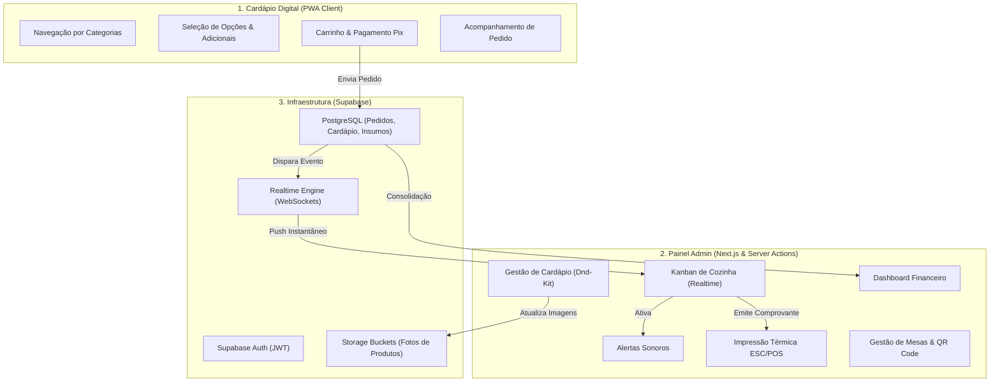

<div align="center">
  # MENU BAR RESTAURANTE
  
  **Ecossistema Omnichannel de Gestão de Restaurantes, Cardápio Digital PWA e Operação de Cozinha**

  [](https://nextjs.org/)
  [](https://react.dev/)
  [](https://www.typescriptlang.org/)
  [](https://supabase.com/)
  [](https://tailwindcss.com/)
  [](https://seumanel.vercel.app/menu)

</div>

---

## Visão Geral do Sistema

O **Menu Bar Restaurante** (conhecido como *Seu Manel*) é uma plataforma de gestão gastronômica de alta performance projetada para otimizar operações de atendimento presencial, delivery e retirada. O sistema conecta a experiência do cliente através de um **Cardápio Digital PWA** dinâmico ao **Painel Administrativo de Cozinha**, garantindo atualização instantânea de pedidos via WebSockets e emissão automática de comprovantes.

A arquitetura atende a quatro pilares estratégicos de engenharia:
1. **Atendimento Digital e Autoatendimento**: Interface mobile responsiva para consulta de produtos, seleção de acompanhamentos, cálculo dinâmico de taxa de entrega e emissão de cobranças Pix via QR Code.
2. **Operação de Cozinha Reativa (Realtime)**: Fila de pedidos Kanban atualizada instantaneamente via Supabase Realtime, com notificações sonoras configuráveis e integração com impressoras térmicas ESC/POS (58mm e 80mm).
3. **Gestão de Mesas e Comandas**: Gerador de QR Code exclusivo por mesa para atendimento presencial autônomo e controle unificado de comandas abertas.
4. **Administração Estratégica de Negócio**: Painel executivo para controle de estoque de insumos, relatórios de faturamento diário/mensal e gestão de catálogo com reordenação drag and drop (Dnd-Kit).

---

## Demonstração da Interface (Cardápio Mobile PWA)

<div align="center">

 &nbsp;
 &nbsp;
 &nbsp;


<br><br>

 &nbsp;
 &nbsp;
 &nbsp;


<br><br>

 &nbsp;


</div>

---

## Funcionalidades Detalhadas do Painel Administrativo

### 1. Fila de Pedidos Kanban em Tempo Real
- **Sincronização Reativa**: Transmissão imediata de novos pedidos via WebSockets sem necessidade de recarregar a tela.
- **Fluxo Operacional**: Movimentação de pedidos entre colunas (Pendente, Em Preparo, Pronto, Em Transporte, Concluído).
- **Alertas Sonoros**: Notificação em áudio configurável para alertar a equipe de cozinha a cada novo pedido recebido.
- **Impressão Térmica ESC/POS**: Emissão automática ou manual de comprovantes para cozinha e cliente formatados para impressoras térmicas (58mm e 80mm).

### 2. Gestão de Cardápio e Catálogo
- **Gerenciador de Categorias**: Criação, edição e reordenação interativa de categorias via arrastar e soltar (Dnd-Kit).
- **Cadastro Avançado de Produtos**: Definição de preços, fotos, descrições, tags de alérgenos e controle de disponibilidade.
- **Grupo de Adicionais e Acompanhamentos**: Configuração de adicionais obrigatórios e opcionais com limite mínimo e máximo de escolhas.

### 3. Gestão de Mesas e Atendimento Presencial
- **Mapeamento de Mesas**: Painel visual de controle de mesas abertas, ocupadas e reservadas.
- **Gerador de QR Code por Mesa**: Criação automática de QR Codes vinculados a cada mesa para autoatendimento presencial pelo cliente.
- **Fechamento de Comandas**: Consolidação de consumo por mesa com emissão de extrato de conta.

### 4. Controle de Insumos e Estoque
- **Baixa Automática de Estoque**: Desconto de insumos à medida que os pedidos são confirmados na cozinha.
- **Alertas de Estoque Mínimo**: Notificações visuais no painel para insumos próximos do limite de esgotamento.
- **Histórico de Movimentações**: Registro completo de entradas, saídas e ajustes de estoque.

### 5. Relatórios Financeiros e Analytics
- **Dashboard de Desempenho**: Gráficos analíticos de faturamento diário, semanal e mensal construídos com Recharts.
- **Indicadores Chave (KPIs)**: Monitoramento de ticket médio, volume total de pedidos e tempo médio de preparo.
- **Ranking de Produtos**: Lista dos itens mais vendidos por categoria e período.

---

## Diagrama de Arquitetura do Sistema



---

## Tecnologias e Engenharia de Stack

### Frontend e Framework
- **Next.js 15.0**: App Router, Server Actions e renderização híbrida (SSG/SSR).
- **React 19.0**: Componentização moderna e estado reativo.
- **TypeScript 5.0 (Strict Mode)**: Tipagem estática em todas as camadas da aplicação.
- **Tailwind CSS 3.4**: Estilização baseada em tokens utilitários com suporte a temas (Light/Dark Mode via Next-Themes).
- **Dnd-Kit**: Biblioteca de drag and drop para reordenação de cardápio e Kanban.
- **Lucide React**: Biblioteca de ícones vetoriais.
- **Recharts**: Renderização de gráficos analíticos financeiros.

### Backend e Infraestrutura
- **Supabase PostgreSQL**: Banco de dados relacional com políticas de Row Level Security (RLS).
- **Supabase Realtime**: Transmissão WebSockets de alterações de pedidos em tempo real.
- **Supabase Auth**: Gerenciamento seguro de acesso para gestores e operadores de cozinha.
- **Supabase Storage**: Armazenamento e otimização de imagens do cardápio.
- **Vercel**: Hospedagem global em infraestrutura Edge Serverless.

---

## Estrutura do Projeto

```text
Menu-bar-restaurante/
├── admin/
│   ├── src/
│   │   ├── app/                # Rotas do Next.js App Router (Admin, Menu, Pedidos, Relatórios)
│   │   ├── components/         # Componentes React de UI (Kanban, Modais, Gráficos, Impressão)
│   │   ├── hooks/              # Custom Hooks para Realtime, Áudio e Impressão Térmica
│   │   ├── lib/                # Configurações do cliente Supabase e utilitários
│   │   └── types/              # Interfaces TypeScript do banco de dados e pedidos
│   ├── public/                 # Ativos estáticos e sons de notificação
│   ├── next.config.ts          # Configurações de otimização de imagens e rotas do Next.js
│   ├── tailwind.config.ts      # Configuração do Design System e temas Tailwind
│   └── package.json            # Manifesto de dependências do projeto
└── docs/                       # Documentação técnica e especificações de banco de dados
```

---

## Instalação e Execução Local

### Pré-requisitos
- **Node.js**: `v18.0.0` ou superior
- **npm**: `v9.0.0` ou superior

### Passos para Instalação

1. **Clonar o Repositório:**
   ```bash
   git clone https://github.com/Alan-silva01/Menu-bar-restaurante.git
   cd Menu-bar-restaurante/admin
   ```

2. **Instalar Dependências:**
   ```bash
   npm install
   ```

3. **Configuração de Variáveis de Ambiente:**
   Crie o arquivo `.env.local` no diretório `admin/`:
   ```env
   NEXT_PUBLIC_SUPABASE_URL=sua_url_do_supabase
   NEXT_PUBLIC_SUPABASE_ANON_KEY=sua_chave_anonima_do_supabase
   ```

4. **Executar Servidor de Desenvolvimento:**
   ```bash
   npm run dev
   ```
   Acesse no navegador em `http://localhost:3000` ou acesse a versão pública em `https://seumanel.vercel.app/menu`.

5. **Gerar Build de Produção:**
   ```bash
   npm run build
   ```

---

<div align="center">
  <p>Desenvolvido por <strong>Alan Silva</strong> | Soluções em Automação e Software Empresarial</p>
</div>
