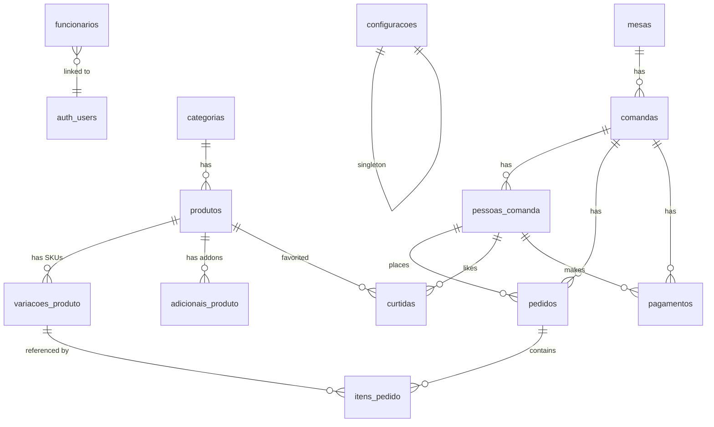

# 🗄️ Banco de Dados — Supabase (PostgreSQL)

## Regras Globais

- **Timezone:** `America/Sao_Paulo` em TODAS as tabelas
- **IDs:** `nanoid(12)` — curtos, URL-safe (ex: `pd_a7k2m9x3`)
- **Tipo:** `TIMESTAMPTZ` em todo campo de data/hora
- **JSONB:** Apenas propriedades visuais pontuais; variantes (SKUs) e extras (adicionais) são Tabelas Relacionais para controle real de estoque e métricas precisas.
- **Índices Rápidos:** `estoque` nas variações e tabelas dimensionais otimizadas para carregamento veloz do frontend.
- **Realtime:** Habilitado APENAS nas tabelas que precisam.

```sql
-- Migration 0: Timezone
ALTER DATABASE postgres SET timezone TO 'America/Sao_Paulo';
```

---

## Diagrama de Relacionamentos



---

## Tabelas Principais (14)

### 1. `configuracoes` — Configurações Globais (Singleton)

> Sempre 1 registro com `id = 'global'`

| Coluna | Tipo | Descrição |
|--------|------|-----------|
| `id` | `TEXT PK` | Sempre `'global'` |
| `couvert_ativo` | `BOOLEAN` | Couvert obrigatório? |
| `valor_couvert` | `NUMERIC(10,2)` | Valor por pessoa (ex: 10.00) |
| `nome_estabelecimento` | `TEXT` | "Seu Manel Bar" |
| `atualizado_em` | `TIMESTAMPTZ DEFAULT now()` | — |

**Indexes:** nenhum (1 registro)
**Realtime:** ✅ — mudança de couvert reflete em todos os clientes instantaneamente

---

### 2. `funcionarios` — Funcionários / Admins

| Coluna | Tipo | Descrição |
|--------|------|-----------|
| `id` | `TEXT PK` | nanoid(12) |
| `auth_id` | `UUID UNIQUE` | → `auth.users.id` (Supabase Auth) |
| `nome` | `TEXT NOT NULL` | Nome completo |
| `email` | `TEXT UNIQUE` | Email de login |
| `cargo` | `TEXT NOT NULL` | `'dono'` ou `'admin'` |
| `foto_url` | `TEXT` | Foto (opcional) |
| `ativo` | `BOOLEAN DEFAULT true` | Desativar sem deletar |
| `criado_em` | `TIMESTAMPTZ DEFAULT now()` | — |
| `criado_por` | `TEXT FK → funcionarios.id` | Quem cadastrou |

**Indexes:** `(auth_id)`, `(cargo)`, `(ativo)`

---

### 3. `categorias` — Categorias do Menu

| Coluna | Tipo | Descrição |
|--------|------|-----------|
| `id` | `TEXT PK` | nanoid(12) |
| `nome` | `TEXT NOT NULL` | "Pastéis", "Drinks" |
| `slug` | `TEXT UNIQUE` | URL-friendly |
| `icone` | `TEXT` | Emoji ou URL do ícone |
| `ordem` | `SMALLINT` | Ordem de exibição (1, 2, 3...) |
| `ativo` | `BOOLEAN DEFAULT true` | Toggle visibilidade |
| `criado_em` | `TIMESTAMPTZ DEFAULT now()` | — |

**Indexes:** `(slug)`, `(ordem)`, `(ativo)`
**Realtime:** ✅ — toggle ativa/desativa categoria inteira no menu

---

### 4. `produtos` — Produtos

| Coluna | Tipo | Descrição |
|--------|------|-----------|
| `id` | `TEXT PK` | nanoid(12) |
| `categoria_id` | `TEXT FK → categorias.id` | — |
| `nome` | `TEXT NOT NULL` | "Picanha na Chapa" |
| `slug` | `TEXT UNIQUE` | — |
| `descricao` | `TEXT` | Ingredientes, acompanhamentos |
| `imagem_url` | `TEXT` | Cloudinary URL |
| `eh_combo` | `BOOLEAN DEFAULT false` | — |
| `tempo_preparo_min` | `SMALLINT` | Tempo base em minutos |
| `disponivel` | `BOOLEAN DEFAULT true` | Toggle master (desativa tudo) |
| `ordem` | `SMALLINT` | — |
| `criado_em` | `TIMESTAMPTZ DEFAULT now()` | — |

**Indexes:** `(categoria_id)`, `(slug)`, `(disponivel)`
**Realtime:** ✅ — toggle disponibilidade master.

---

### 5. `variacoes_produto` — Variantes (SKUs / Tamanhos / Taças)

| Coluna | Tipo | Descrição |
|--------|------|-----------|
| `id` | `TEXT PK` | nanoid(12) |
| `produto_id` | `TEXT FK → produtos.id` | Produto "Pai" |
| `nome` | `TEXT NOT NULL` | "Taça", "Garrafa (750ml)", "Grande" |
| `preco` | `NUMERIC(10,2) NOT NULL` | 130.00 |
| `serve_pessoas` | `SMALLINT` | Quantas pessoas serve (opcional) |
| `ativo` | `BOOLEAN DEFAULT true` | Toggle específico |
| `estoque` | `INTEGER DEFAULT -1` | `-1` = ilimitado, `0` = esgotado |
| `estoque_minimo` | `INTEGER DEFAULT 5` | Limite para disparar alerta "Estoque Baixo" no Dashboard |
| `ordem` | `SMALLINT` | Para ordenar no app |

**Indexes:** `(produto_id)`, `(estoque)`, `(ativo)`
**Realtime:** ✅ — toggle status e decremento de estoque instantâneo.

---

### 6. `adicionais_produto` — Extras e Acompanhamentos

| Coluna | Tipo | Descrição |
|--------|------|-----------|
| `id` | `TEXT PK` | nanoid(12) |
| `produto_id` | `TEXT FK → produtos.id` | Produto "Pai" |
| `nome` | `TEXT NOT NULL` | "Arroz", "Farofa", "Borda Recheada" |
| `preco` | `NUMERIC(10,2) NOT NULL` | 7.00 |
| `qtd_maxima` | `SMALLINT DEFAULT 1` | Quantidade máxima pro cliente pedir |
| `ativo` | `BOOLEAN DEFAULT true` | Toggle específico |
| `estoque` | `INTEGER DEFAULT -1` | `-1` = ilimitado |
| `estoque_minimo` | `INTEGER DEFAULT 5` | Limite para "Estoque Baixo" |

**Indexes:** `(produto_id)`, `(ativo)`
**Realtime:** ✅ — toggle status e decremento de estoque.

**Regras de UI:**
| Situação | Comportamento Visual |
|----------|---------------------|
| Produto `disponivel = false` | Produto some do menu (ou Blur + "ESGOTADO") |
| Variante `estoque = 0` | A opção Variante fica cinza + "Esgotado" |
| Variante `estoque > 0 && estoque < qty` | Modal: "Só temos X unidades desta variação!" |
| Variante/Addon `ativo = false` | Some do seletor em realtime |

---

### 7. `mesas` — Mesas

| Coluna | Tipo | Descrição |
|--------|------|-----------|
| `id` | `TEXT PK` | ex: `"mesa_01"` |
| `numero` | `SMALLINT UNIQUE` | 1, 2, 3... |
| `qr_code_url` | `TEXT` | URL do QR |
| `capacidade` | `SMALLINT` | 4, 6, 8... |
| `status` | `TEXT` | `'disponivel'`, `'ocupada'` |

**Indexes:** `(numero)`, `(status)`

---

### 8. `comandas` — Comandas (sessão por mesa)

| Coluna | Tipo | Descrição |
|--------|------|-----------|
| `id` | `TEXT PK` | nanoid(12) |
| `mesa_id` | `TEXT FK → mesas.id` | — |
| `status` | `TEXT` | `'aberta'`, `'solicitando_fechamento'`, `'fechada'` |
| `valor_couvert` | `NUMERIC(10,2)` | Snapshot do valor couvert |
| `couvert_ativo` | `BOOLEAN` | Snapshot se estava ativo |
| `qtd_pessoas` | `SMALLINT DEFAULT 1` | — |
| `subtotal` | `NUMERIC(10,2) DEFAULT 0` | — |
| `total` | `NUMERIC(10,2) DEFAULT 0` | — |
| `aberta_em` | `TIMESTAMPTZ DEFAULT now()` | — |
| `fechada_em` | `TIMESTAMPTZ` | — |
| `aberta_por` | `TEXT` | `'cliente'` ou `funcionarios.id` |

**Indexes:** `(mesa_id)`, `(status)`, `(aberta_em DESC)`
**Realtime:** ✅ — escuta mudanças de status (fechar comanda, etc.)

---

### 9. `pessoas_comanda` — Pessoas na Comanda

| Coluna | Tipo | Descrição |
|--------|------|-----------|
| `id` | `TEXT PK` | nanoid(8) |
| `comanda_id` | `TEXT FK → comandas.id` | — |
| `nome` | `TEXT NOT NULL` | "Alan", "Helena" |
| `subtotal` | `NUMERIC(10,2) DEFAULT 0` | — |
| `criado_em` | `TIMESTAMPTZ DEFAULT now()` | — |

**Indexes:** `(comanda_id)`

---

### 10. `pedidos` — Pedidos

| Coluna | Tipo | Descrição |
|--------|------|-----------|
| `id` | `TEXT PK` | nanoid(12) |
| `comanda_id` | `TEXT FK → comandas.id` | — |
| `pessoa_id` | `TEXT FK → pessoas_comanda.id` | Quem pediu |
| `numero_mesa` | `SMALLINT` | Denormalizado para kanban rápido |
| `nome_pessoa` | `TEXT` | Denormalizado para kanban rápido |
| `status` | `TEXT` | `'recebido'`, `'preparando'`, `'entregue'` |
| `total` | `NUMERIC(10,2) DEFAULT 0` | — |
| `observacoes` | `TEXT` | — |
| `criado_em` | `TIMESTAMPTZ DEFAULT now()` | — |
| `atualizado_em` | `TIMESTAMPTZ DEFAULT now()` | — |

**Indexes:** `(comanda_id)`, `(status)`, `(criado_em DESC)`, `(numero_mesa)`
**Realtime:** ✅ — kanban admin + acompanhamento do cliente

---

### 11. `itens_pedido` — Itens do Pedido

| Coluna | Tipo | Descrição |
|--------|------|-----------|
| `id` | `TEXT PK` | nanoid(8) |
| `pedido_id` | `TEXT FK → pedidos.id` | — |
| `produto_id` | `TEXT FK → produtos.id` | Identificador base |
| `variacao_id` | `TEXT FK → variacoes_produto.id` | SKU real vendido (obriga saber o tamanho/taça) |
| `nome_produto` | `TEXT` | Denorm para histórico |
| `nome_variacao` | `TEXT` | "Grande", "Taça" (denorm) |
| `adicionais` | `JSONB` | `[{name, price, qty}]` |
| `quantidade` | `SMALLINT DEFAULT 1` | — |
| `preco_unitario` | `NUMERIC(10,2)` | — |
| `preco_total` | `NUMERIC(10,2)` | — |
| `observacoes` | `TEXT` | — |

**Indexes:** `(pedido_id)`, `(produto_id)`

---

### 12. `pagamentos` — Pagamentos

| Coluna | Tipo | Descrição |
|--------|------|-----------|
| `id` | `TEXT PK` | nanoid(12) |
| `comanda_id` | `TEXT FK → comandas.id` | — |
| `pessoa_id` | `TEXT FK → pessoas_comanda.id NULLABLE` | NULL = pagou tudo |
| `metodo` | `TEXT` | `'dinheiro'`, `'credito'`, `'debito'`, `'pix'` |
| `valor` | `NUMERIC(10,2)` | — |
| `tipo` | `TEXT` | `'total'`, `'parcial'`, `'individual'`, `'divisao_igual'` |
| `criado_por` | `TEXT FK → funcionarios.id` | Garçom que registrou |
| `criado_em` | `TIMESTAMPTZ DEFAULT now()` | — |

**Indexes:** `(comanda_id)`, `(pessoa_id)`, `(criado_em DESC)`

---

### 13. `curtidas` — Curtidas/Favoritos

| Coluna | Tipo | Descrição |
|--------|------|-----------|
| `id` | `TEXT PK` | nanoid(8) |
| `produto_id` | `TEXT FK → produtos.id` | — |
| `pessoa_id` | `TEXT FK → pessoas_comanda.id` | — |
| `criado_em` | `TIMESTAMPTZ DEFAULT now()` | — |

**Indexes:** `(produto_id)`, `(pessoa_id)`, UNIQUE `(produto_id, pessoa_id)`

---

## RLS — Row Level Security (Todas as Políticas)

| Tabela | SELECT | INSERT | UPDATE | DELETE |
|--------|--------|--------|--------|--------|
| `configuracoes` | ✅ Público | ❌ | ✅ owner only | ❌ |
| `funcionarios` | ✅ authenticated | ✅ owner only | ✅ owner only | ✅ owner only |
| `categorias` | ✅ Público | ✅ staff | ✅ staff | ✅ owner only |
| `produtos` | ✅ Público | ✅ staff | ✅ staff | ✅ owner only |
| `variacoes_produto` | ✅ Público | ✅ staff | ✅ staff | ✅ owner only |
| `adicionais_produto` | ✅ Público | ✅ staff | ✅ staff | ✅ owner only |
| `mesas` | ✅ Público | ✅ staff | ✅ staff | ✅ owner only |
| `comandas` | ✅ Público | ✅ Público | ✅ Público* | ❌ |
| `pessoas_comanda` | ✅ Público | ✅ Público | ✅ staff | ❌ |
| `pedidos` | ✅ Público | ✅ Público | ✅ staff | ❌ |
| `itens_pedido` | ✅ Público | ✅ Público | ❌ | ❌ |
| `pagamentos` | ✅ staff | ✅ staff | ❌ | ❌ |
| `curtidas` | ✅ Público | ✅ Público | ❌ | ✅ Público** |

> \* UPDATE comandas anon: apenas `status → 'solicitando_fechamento'` (validado via Edge Function)
> \*\* DELETE curtidas: guest pode remover seu próprio favorito

### Função Helper para RLS:
```sql
CREATE FUNCTION obter_cargo_funcionario()
RETURNS TEXT AS $$
  SELECT cargo FROM funcionarios
  WHERE auth_id = auth.uid()
  AND ativo = true
$$ LANGUAGE sql SECURITY DEFINER;
```

---

## Estoque — Regras de Negócio

```
Ao criar itens_pedido:
  1. Verificar variacoes_produto.estoque >= quantidade (usando variacao_id)
  2. Se estoque == -1 → ilimitado, pular
  3. Se estoque < quantidade → REJEITAR + retornar estoque atual pro cliente
  4. UPDATE variacoes_produto SET estoque = estoque - quantidade
  5. UPDATE adicionais_produto decrementando seus estoques (itens de addon no JSON de request)
```

---

## Canais Real-time

| Canal | Tabela | Eventos | Quem Escuta |
|-------|--------|---------|-------------|
| `admin-vendas` | `pedidos` | INSERT, UPDATE | Admin Kanban |
| `admin-comandas` | `comandas` | UPDATE | Admin (alerta fechar) |
| `sku-disponibilidade` | `variacoes_produto` | UPDATE | Clientes (blur/esgotado SKU específico) |
| `configuracoes-gerais` | `configuracoes` | UPDATE | Clientes (couvert) |
| `cliente-pedidos:{comanda_id}` | `pedidos` | UPDATE | Cliente específico |
