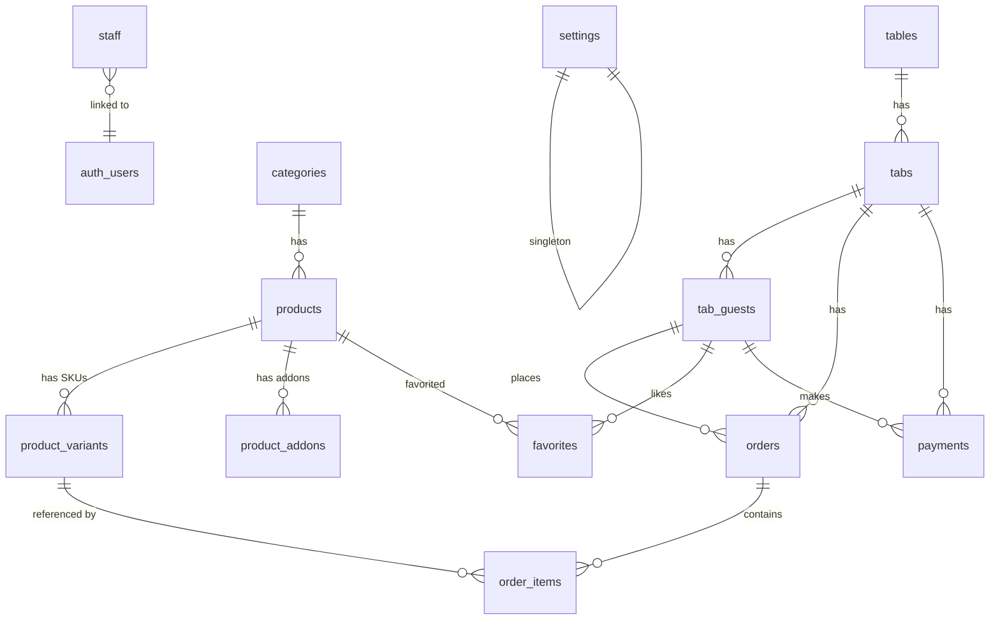

# 🗄️ Banco de Dados — Supabase (PostgreSQL)

## Regras Globais

- **Timezone:** `America/Sao_Paulo` em TODAS as tabelas
- **IDs:** `nanoid(12)` — curtos, URL-safe (ex: `ord_a7k2m9x3`)
- **Tipo:** `TIMESTAMPTZ` em todo campo de data/hora
- **JSONB:** Apenas propriedades visuais pontuais; variantes (SKUs) e extras (addons) são Tabelas Relacionais para controle real de estoque e métricas precisas.
- **Índices Rápidos:** `stock` nas variantes e tabelas dimensionais otimizadas para carregamento veloz do frontend.
- **Realtime:** Habilitado APENAS nas tabelas que precisam (orders, tabs, products, product_variants, settings)

```sql
-- Migration 0: Timezone
ALTER DATABASE postgres SET timezone TO 'America/Sao_Paulo';
```

---

## Diagrama de Relacionamentos



---

## Tabelas Principais (14)

### 1. `settings` — Configurações Globais (Singleton)

> Sempre 1 registro com `id = 'global'`

| Coluna | Tipo | Descrição |
|--------|------|-----------|
| `id` | `TEXT PK` | Sempre `'global'` |
| `couvert_enabled` | `BOOLEAN` | Couvert obrigatório? |
| `couvert_value` | `NUMERIC(10,2)` | Valor por pessoa (ex: 10.00) |
| `establishment_name` | `TEXT` | "Seu Manel Bar" |
| `updated_at` | `TIMESTAMPTZ DEFAULT now()` | — |

**Indexes:** nenhum (1 registro)
**Realtime:** ✅ — mudança de couvert reflete em todos os clientes instantaneamente

---

### 2. `staff` — Funcionários / Admins

| Coluna | Tipo | Descrição |
|--------|------|-----------|
| `id` | `TEXT PK` | nanoid(12) |
| `auth_id` | `UUID UNIQUE` | → `auth.users.id` (Supabase Auth) |
| `name` | `TEXT NOT NULL` | Nome completo |
| `email` | `TEXT UNIQUE` | Email de login |
| `role` | `TEXT NOT NULL` | `'owner'` ou `'admin'` |
| `avatar_url` | `TEXT` | Foto (opcional) |
| `is_active` | `BOOLEAN DEFAULT true` | Desativar sem deletar |
| `created_at` | `TIMESTAMPTZ DEFAULT now()` | — |
| `created_by` | `TEXT FK → staff.id` | Quem cadastrou |

**Indexes:** `(auth_id)`, `(role)`, `(is_active)`

**Fluxo:**
1. Owner clica "Adicionar Funcionário" no admin
2. Edge Function cria user no Supabase Auth + insere em `staff`
3. Funcionário recebe email com credenciais
4. Login → frontend consulta `staff` para obter `role`
5. `is_active = false` → login bloqueado

---

### 3. `categories` — Categorias do Menu

| Coluna | Tipo | Descrição |
|--------|------|-----------|
| `id` | `TEXT PK` | nanoid(12) |
| `name` | `TEXT NOT NULL` | "Pastéis", "Drinks" |
| `slug` | `TEXT UNIQUE` | URL-friendly |
| `icon` | `TEXT` | Emoji ou URL do ícone |
| `sort_order` | `SMALLINT` | Ordem de exibição (1, 2, 3...) |
| `is_active` | `BOOLEAN DEFAULT true` | Toggle visibilidade |
| `created_at` | `TIMESTAMPTZ DEFAULT now()` | — |

**Indexes:** `(slug)`, `(sort_order)`, `(is_active)`
**Realtime:** ✅ — toggle ativa/desativa categoria inteira no menu

---

### 4. `products` — Produtos

| Coluna | Tipo | Descrição |
|--------|------|-----------|
| `id` | `TEXT PK` | nanoid(12) |
| `category_id` | `TEXT FK → categories.id` | — |
| `name` | `TEXT NOT NULL` | "Picanha na Chapa" |
| `slug` | `TEXT UNIQUE` | — |
| `description` | `TEXT` | Ingredientes, acompanhamentos |
| `image_url` | `TEXT` | Cloudinary URL |
| `tags` | `TEXT[]` | `['destaque', 'novo']` |
| `is_combo` | `BOOLEAN DEFAULT false` | — |
| `prep_time_min` | `SMALLINT` | Tempo base em minutos |
| `is_available` | `BOOLEAN DEFAULT true` | Toggle master (desativa tudo) |
| `sort_order` | `SMALLINT` | — |
| `created_at` | `TIMESTAMPTZ DEFAULT now()` | — |

**Indexes:** `(category_id)`, `(slug)`, `(is_available)`, `(tags)` GIN
**Realtime:** ✅ — toggle disponibilidade master.

---

### 5. `product_variants` — Variantes (SKUs / Tamanhos / Taças)

> Representa o item real sendo vendido. O preço e estoque ficam **aqui**.

| Coluna | Tipo | Descrição |
|--------|------|-----------|
| `id` | `TEXT PK` | nanoid(12) |
| `product_id` | `TEXT FK → products.id` | Produto "Pai" |
| `name` | `TEXT NOT NULL` | "Taça", "Garrafa (750ml)", "Grande" |
| `price` | `NUMERIC(10,2) NOT NULL` | 130.00 |
| `serves` | `SMALLINT` | Quantas pessoas serve (opcional) |
| `is_active` | `BOOLEAN DEFAULT true` | Toggle específico |
| `stock` | `INTEGER DEFAULT -1` | `-1` = ilimitado, `0` = esgotado |
| `min_stock` | `INTEGER DEFAULT 5` | Limite para disparar alerta "Estoque Baixo" no Dashboard |
| `sort_order` | `SMALLINT` | Para ordenar no app |

**Indexes:** `(product_id)`, `(stock)`, `(is_active)`
**Realtime:** ✅ — toggle status e decremento de estoque instantâneo.

---

### 6. `product_addons` — Extras e Acompanhamentos

| Coluna | Tipo | Descrição |
|--------|------|-----------|
| `id` | `TEXT PK` | nanoid(12) |
| `product_id` | `TEXT FK → products.id` | Produto "Pai" |
| `name` | `TEXT NOT NULL` | "Arroz", "Farofa", "Borda Recheada" |
| `price` | `NUMERIC(10,2) NOT NULL` | 7.00 |
| `max_qty` | `SMALLINT DEFAULT 1` | Quantidade máxima pro cliente pedir |
| `is_active` | `BOOLEAN DEFAULT true` | Toggle específico |
| `stock` | `INTEGER DEFAULT -1` | `-1` = ilimitado |
| `min_stock` | `INTEGER DEFAULT 5` | Limite para "Estoque Baixo" |

**Indexes:** `(product_id)`, `(is_active)`
**Realtime:** ✅ — toggle status e decremento de estoque.

**Regras de UI:**
| Situação | Comportamento Visual |
|----------|---------------------|
| Produto `is_available = false` | Produto some do menu (ou Blur + "ESGOTADO") |
| Variante `stock = 0` | A opção Variante fica cinza + "Esgotado" |
| Variante `stock > 0 && stock < qty` | Modal: "Só temos X unidades desta variação!" |
| Variante/Addon `is_active = false` | Some do seletor em realtime |

---

### 7. `tables` — Mesas

| Coluna | Tipo | Descrição |
|--------|------|-----------|
| `id` | `TEXT PK` | ex: `"mesa_01"` |
| `number` | `SMALLINT UNIQUE` | 1, 2, 3... |
| `qr_code_url` | `TEXT` | URL do QR |
| `capacity` | `SMALLINT` | 4, 6, 8... |
| `status` | `TEXT` | `'available'`, `'occupied'` |

**Indexes:** `(number)`, `(status)`

---

### 8. `tabs` — Comandas (sessão por mesa)

| Coluna | Tipo | Descrição |
|--------|------|-----------|
| `id` | `TEXT PK` | nanoid(12) |
| `table_id` | `TEXT FK → tables.id` | — |
| `status` | `TEXT` | `'open'`, `'requesting_close'`, `'closed'` |
| `couvert_pp` | `NUMERIC(10,2)` | Snapshot do valor couvert |
| `couvert_enabled` | `BOOLEAN` | Snapshot se estava ativo |
| `num_guests` | `SMALLINT DEFAULT 1` | — |
| `subtotal` | `NUMERIC(10,2) DEFAULT 0` | — |
| `total` | `NUMERIC(10,2) DEFAULT 0` | — |
| `opened_at` | `TIMESTAMPTZ DEFAULT now()` | — |
| `closed_at` | `TIMESTAMPTZ` | — |
| `opened_by` | `TEXT` | `'customer'` ou `staff.id` |

**Indexes:** `(table_id)`, `(status)`, `(opened_at DESC)`
**Realtime:** ✅ — escuta mudanças de status (fechar comanda, etc.)

---

### 9. `tab_guests` — Pessoas na Comanda

| Coluna | Tipo | Descrição |
|--------|------|-----------|
| `id` | `TEXT PK` | nanoid(8) |
| `tab_id` | `TEXT FK → tabs.id` | — |
| `name` | `TEXT NOT NULL` | "Alan", "Helena" |
| `subtotal` | `NUMERIC(10,2) DEFAULT 0` | — |
| `created_at` | `TIMESTAMPTZ DEFAULT now()` | — |

**Indexes:** `(tab_id)`

---

### 10. `orders` — Pedidos

| Coluna | Tipo | Descrição |
|--------|------|-----------|
| `id` | `TEXT PK` | nanoid(12) |
| `tab_id` | `TEXT FK → tabs.id` | — |
| `guest_id` | `TEXT FK → tab_guests.id` | Quem pediu |
| `table_num` | `SMALLINT` | Denormalizado para kanban rápido |
| `guest_name` | `TEXT` | Denormalizado para kanban rápido |
| `status` | `TEXT` | `'received'`, `'preparing'`, `'served'` |
| `total` | `NUMERIC(10,2) DEFAULT 0` | — |
| `notes` | `TEXT` | — |
| `created_at` | `TIMESTAMPTZ DEFAULT now()` | — |
| `updated_at` | `TIMESTAMPTZ DEFAULT now()` | — |

**Indexes:** `(tab_id)`, `(status)`, `(created_at DESC)`, `(table_num)`
**Realtime:** ✅ — kanban admin + acompanhamento do cliente

---

### 11. `order_items` — Itens do Pedido

| Coluna | Tipo | Descrição |
|--------|------|-----------|
| `id` | `TEXT PK` | nanoid(8) |
| `order_id` | `TEXT FK → orders.id` | — |
| `product_id` | `TEXT FK → products.id` | Identificador base |
| `variant_id` | `TEXT FK → product_variants.id` | SKU real vendido (obriga saber o tamanho/taça/etc) |
| `product_name` | `TEXT` | Denorm para histórico |
| `variant_name` | `TEXT` | "Grande", "Taça" (denorm) |
| `addons` | `JSONB` | `[{name, price, qty}]` |
| `quantity` | `SMALLINT DEFAULT 1` | — |
| `unit_price` | `NUMERIC(10,2)` | — |
| `total_price` | `NUMERIC(10,2)` | — |
| `notes` | `TEXT` | — |

**Indexes:** `(order_id)`, `(product_id)`

---

### 12. `payments` — Pagamentos

| Coluna | Tipo | Descrição |
|--------|------|-----------|
| `id` | `TEXT PK` | nanoid(12) |
| `tab_id` | `TEXT FK → tabs.id` | — |
| `guest_id` | `TEXT FK → tab_guests.id NULLABLE` | NULL = pagou tudo |
| `method` | `TEXT` | `'cash'`, `'credit'`, `'debit'`, `'pix'` |
| `amount` | `NUMERIC(10,2)` | — |
| `type` | `TEXT` | `'full'`, `'partial'`, `'individual'`, `'split_equal'` |
| `created_by` | `TEXT FK → staff.id` | Garçom que registrou |
| `created_at` | `TIMESTAMPTZ DEFAULT now()` | — |

**Indexes:** `(tab_id)`, `(guest_id)`, `(created_at DESC)`

---

### 13. `favorites` — Curtidas/Favoritos

| Coluna | Tipo | Descrição |
|--------|------|-----------|
| `id` | `TEXT PK` | nanoid(8) |
| `product_id` | `TEXT FK → products.id` | — |
| `guest_id` | `TEXT FK → tab_guests.id` | — |
| `created_at` | `TIMESTAMPTZ DEFAULT now()` | — |

**Indexes:** `(product_id)`, `(guest_id)`, UNIQUE `(product_id, guest_id)`

---

## RLS — Row Level Security (Todas as Políticas)

| Tabela | SELECT | INSERT | UPDATE | DELETE |
|--------|--------|--------|--------|--------|
| `settings` | ✅ Público | ❌ | ✅ owner only | ❌ |
| `staff` | ✅ authenticated | ✅ owner only | ✅ owner only | ✅ owner only |
| `categories` | ✅ Público | ✅ staff | ✅ staff | ✅ owner only |
| `products` | ✅ Público | ✅ staff | ✅ staff | ✅ owner only |
| `product_variants` | ✅ Público | ✅ staff | ✅ staff | ✅ owner only |
| `product_addons` | ✅ Público | ✅ staff | ✅ staff | ✅ owner only |
| `tables` | ✅ Público | ✅ staff | ✅ staff | ✅ owner only |
| `tabs` | ✅ Público | ✅ Público | ✅ Público* | ❌ |
| `tab_guests` | ✅ Público | ✅ Público | ✅ staff | ❌ |
| `orders` | ✅ Público | ✅ Público | ✅ staff | ❌ |
| `order_items` | ✅ Público | ✅ Público | ❌ | ❌ |
| `payments` | ✅ staff | ✅ staff | ❌ | ❌ |
| `favorites` | ✅ Público | ✅ Público | ❌ | ✅ Público** |

> \* UPDATE tabs anon: apenas `status → 'requesting_close'` (validado via Edge Function)
> \*\* DELETE favorites: guest pode remover seu próprio favorito

### Função Helper para RLS:
```sql
CREATE FUNCTION get_staff_role()
RETURNS TEXT AS $$
  SELECT role FROM staff
  WHERE auth_id = auth.uid()
  AND is_active = true
$$ LANGUAGE sql SECURITY DEFINER;
```

---

## Estoque — Regras de Negócio

```
Ao criar order_item:
  1. Verificar product_variants.stock >= quantity (usando variant_id)
  2. Se stock == -1 → ilimitado, pular
  3. Se stock < quantity → REJEITAR + retornar stock atual pro cliente
  4. UPDATE product_variants SET stock = stock - quantity
  5. UPDATE product_addons decrementando seus estoques (itens de addon no JSON de request)
```

---

## Funções RPC para Métricas

```sql
-- Top 10 mais vendidos (período)
get_top_selling(p_from, p_to) → product_id, product_name, total_qty, total_revenue

-- Top 10 mais curtidos
get_top_favorites() → product_id, product_name, like_count

-- Faturamento por dia
get_daily_revenue(p_from, p_to) → day, total
```

---

## Canais Real-time

| Canal | Tabela | Eventos | Quem Escuta |
|-------|--------|---------|-------------|
| `admin-orders` | `orders` | INSERT, UPDATE | Admin Kanban |
| `admin-tabs` | `tabs` | UPDATE | Admin (alerta fechar) |
| `sku-availability` | `product_variants` | UPDATE | Clientes (blur/esgotado SKU específico) |
| `settings-changes` | `settings` | UPDATE | Clientes (couvert) |
| `customer-orders:{tab_id}` | `orders` | UPDATE | Cliente específico |
