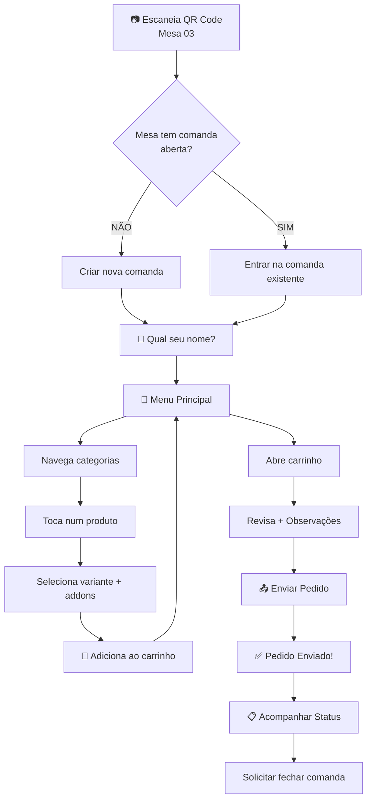

# 📱 UX Flows — Telas do Cliente (Menu/App)

## Fluxo Principal: QR Code → Pedido



---

## Tela 1: Entrada na Mesa (`/mesa/{id}`)

```
┌─────────────────────────┐
│     🏪 SEU MANEL BAR     │
│                         │
│     Mesa 03             │
│                         │
│  ┌───────────────────┐  │
│  │ Qual seu nome?    │  │
│  │ [_______________] │  │
│  │                   │  │
│  │ [Entrar no Menu]  │  │
│  └───────────────────┘  │
│                         │
│  Couvert: R$ 10,00/pess.│
│  (se ativado)           │
└─────────────────────────┘
```

**Lógica:**
- Se já tem comanda aberta → mostra "Outros na mesa: Alan, Helena..."
- Se não tem → cria comanda nova
- Nome é obrigatório (identifica pedidos individuais)
- Couvert aparece como aviso se `settings.couvert_enabled = true`

---

## Tela 2: Menu Principal

```
┌──────────────────────────────┐
│ 🔍 Buscar no menu...         │
│                              │
│ [🥟 Pastéis] [🍢 Espetinhos] │ ← scroll horizontal
│ [🍹 Drinks] [🍺 Cervejas]    │   de categorias
│ [🍟 Petiscos] [🥩 Pratos]    │
│                              │
│ ⭐ DESTAQUES                  │
│ ┌─────────┐ ┌─────────┐      │
│ │ 📸      │ │ 📸      │      │
│ │Picanha G│ │Camarão  │      │
│ │R$ 175   │ │R$ 60    │      │
│ │🔥Popular │ │⭐ Chef   │      │
│ └─────────┘ └─────────┘      │
│                              │
│ 🥟 PASTÉIS                   │
│ ┌─────────┐ ┌─────────┐      │
│ │ 📸      │ │ 📸      │      │
│ │Pastel   │ │Pastel   │      │
│ │Carne    │ │Frango   │      │
│ │R$ 30    │ │R$ 30    │      │
│ └─────────┘ └─────────┘      │
│                              │
│ ───── [ 🛒 Carrinho (3) R$ 97 ] ───│ ← botão flutuante
└──────────────────────────────┘
```

**Funcionalidades:**
- **Busca** por nome + ingrediente (debounce 300ms)
- **Categorias** com scroll horizontal (mobile) ou sidebar (tablet)
- **Destaques** como primeira seção (tag `destaque`)
- **Product Card:** imagem, nome, preço, tags (🔥, ⭐, "Novo")
- **Produto esgotado:** blur na imagem + overlay "ESGOTADO"
- **Carrinho flutuante:** badge com qtd + total, sempre visível
- **Favoritar (❤️):** botão no canto do card
- **Lazy loading:** imagens carregam sob demanda

---

## Tela 3: Página do Produto

```
┌──────────────────────────────┐
│ [← Voltar]    [🛒 3] [❤️]    │
│                              │
│ ┌──────────────────────────┐ │
│ │                          │ │
│ │     📸 IMAGEM GRANDE     │ │
│ │                          │ │
│ └──────────────────────────┘ │
│                              │
│ Picanha na Chapa             │
│ Acompanha: arroz, vinagrete  │
│ ⏱️ ~25 min                    │
│                              │
│ ESCOLHA O TAMANHO:           │
│ ┌─────────────────────────┐  │
│ │ ○ Média (2 pess.) R$125 │  │
│ │ ● Grande (4 pess.) R$175│  │ ← radio
│ └─────────────────────────┘  │
│                              │
│ ACOMPANHAMENTOS:             │
│ ┌─────────────────────────┐  │
│ │ ☑ Arroz         +R$ 7   │  │
│ │ ☑ Farofa         +R$ 5  │  │ ← checkbox
│ │ ☐ Vinagrete      +R$ 7  │  │
│ │ ☐ Purê           +R$ 5  │  │
│ └─────────────────────────┘  │
│                              │
│ QUANTIDADE:  [−] 1 [+]      │
│                              │
│ OBSERVAÇÕES:                 │
│ ┌──────────────────────────┐ │
│ │ Sem cebola, bem passado  │ │
│ └──────────────────────────┘ │
│                              │
│ ┌──────────────────────────┐ │
│ │ 🛒 Adicionar — R$ 187,00 │ │ ← botão fixo bottom
│ └──────────────────────────┘ │
└──────────────────────────────┘
```

**Lógica:**
- Preço recalcula ao mudar variante/addons/quantidade
- Variante com `is_active = false` → NÃO aparece
- Se `stock = 3` e pessoa pede `qty = 5` → modal "Só temos 3!"
- Botão de adicionar: animação de feedback visual
- Produto esgotado → botão desabilitado + mensagem
- Addons com `is_active = false` → NÃO aparece

---

## Tela 4: Carrinho

```
┌──────────────────────────────┐
│ 🛒 SEU CARRINHO               │
│                              │
│ ┌──────────────────────────┐ │
│ │ 📸 Picanha G        x1   │ │
│ │     + Arroz, Farofa      │ │
│ │     "Sem cebola"         │ │
│ │     R$ 187,00    [🗑️]    │ │
│ └──────────────────────────┘ │
│ ┌──────────────────────────┐ │
│ │ 📸 Heineken 600    x2    │ │
│ │     R$ 34,00     [🗑️]    │ │
│ └──────────────────────────┘ │
│                              │
│ ────────────────────────     │
│ Subtotal:        R$ 221,00   │
│ Couvert (1 pess): R$ 10,00   │
│ ────────────────────────     │
│ TOTAL:           R$ 231,00   │
│                              │
│ 📝 Observação geral:         │
│ [_________________________]  │
│                              │
│ ┌──────────────────────────┐ │
│ │  📤 ENVIAR PEDIDO         │ │
│ └──────────────────────────┘ │
│                              │
│ [+ Continuar Pedindo]        │
└──────────────────────────────┘
```

---

## Tela 5: Meus Pedidos (Acompanhamento)

```
┌──────────────────────────────┐
│ 📋 MEUS PEDIDOS — Mesa 03    │
│ Alan                         │
│                              │
│ 🕐 Pedido #1 — 14:32         │
│ ┌──────────────────────────┐ │
│ │ 2x Picanha G      R$350  │ │
│ │ 1x Heineken 600   R$ 17  │ │
│ │ Status: 🍳 PREPARANDO     │ │ ← real-time
│ └──────────────────────────┘ │
│                              │
│ 🕐 Pedido #2 — 15:10         │
│ ┌──────────────────────────┐ │
│ │ 1x Pudim          R$ 10  │ │
│ │ Status: ✅ SERVIDO        │ │
│ └──────────────────────────┘ │
│                              │
│ ────────────────────────     │
│ Meu total: R$ 377,00        │
│                              │
│ ┌──────────────────────────┐ │
│ │ 🔔 SOLICITAR FECHAR       │ │
│ │    COMANDA                │ │ ← alerta pro admin
│ └──────────────────────────┘ │
│                              │
│ [+ Fazer Novo Pedido]        │
└──────────────────────────────┘
```

**Status visual:**
| Status | Ícone | Cor |
|--------|-------|-----|
| Recebido | 📥 | Azul |
| Preparando | 🍳 | Laranja |
| Servido | ✅ | Verde |

---

## Comportamento Real-time no Cliente

| Evento | O que acontece |
|--------|----------------|
| Produto toggle OFF no admin | Imagem fica blur + tag "ESGOTADO" |
| Estoque chega a 0 | Mesmo acima (automático) |
| Variante desativada | Some do seletor de variantes |
| Addon desativado | Some da lista de acompanhamentos |
| Couvert ativado/desativado | Banner aparece/some |
| Status do pedido muda | Card atualiza em "Meus Pedidos" |
| "Fechar comanda" solicitado | Admin recebe alerta 🔔 |

---

## Estratégias de Upsell/UX

| Estratégia | Onde | Como |
|------------|------|------|
| 🔥 Popular | Card no menu | Badge com "Mais pedido" |
| ⭐ Chef recomenda | Card no menu | Badge especial |
| 💰 Economia | Combos | "Economize R$ 30" |
| 🍽️ Completo | Espetinhos | "Completo +R$ 19?" |
| 📸 Foto grande | Detalhe | Imagem em fullscreen |
| 🛒 Carrinho flutuante | Sempre | Badge + total visível |
| ❤️ Favoritar | Card/Detalhe | Coração, salva pro ranking |
| ✨ Animação | Adicionar ao carrinho | Feedback visual |
| 🔍 Busca rápida | Header | Resultados instantâneos |
