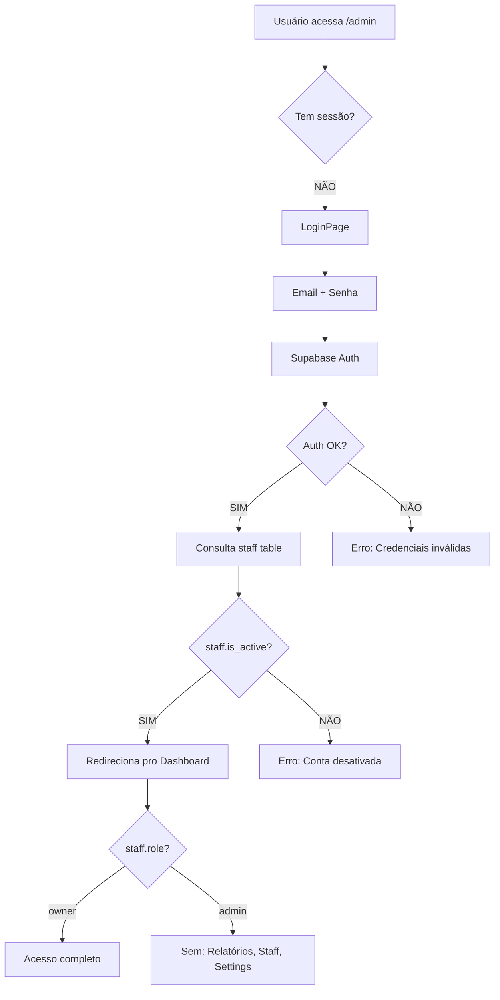

# ⚙️ Estrutura do Projeto + Stack Técnico

## Stack Tecnológico

| Camada | Tecnologia | Por quê |
|--------|-----------|---------|
| **Frontend** | Vite + React 19 | SPA rápida, sem SSR (acesso via QR, sem SEO) |
| **Estilização** | Tailwind CSS v4 | Rapid prototyping, design tokens |
| **Estado Local** | Zustand | Leve, carrinho persistente |
| **Estado Server** | TanStack Query | Cache inteligente, stale-while-revalidate |
| **Backend** | Supabase | PostgreSQL + Auth + Realtime + Edge Functions |
| **Imagens** | Cloudinary | CDN, WebP/AVIF auto, transformações on-the-fly |
| **IDs** | nanoid(12) | Curtos, URL-safe, rápidos de buscar |
| **QR Code** | `qrcode` (npm) | Geração local, sem serviço externo |
| **Impressão** | `react-to-print` + CSS | PDF + formatação 80mm para térmica |
| **Deploy** | Vercel | Zero-config, edge |

---

## Estrutura de Pastas

```
src/
├── App.jsx                     ← Roteamento principal
├── main.jsx                    ← Entry point
│
├── routes/
│   ├── customer/               ← 🔓 SEM AUTH (via QR Code)
│   │   ├── TableEntryPage.jsx  ← "Qual seu nome?" + join na comanda
│   │   ├── MenuPage.jsx        ← Categorias + grid de produtos
│   │   ├── ProductPage.jsx     ← Detalhe + variantes + addons + ❤️
│   │   ├── CartPage.jsx        ← Carrinho + resumo + enviar
│   │   └── MyOrdersPage.jsx    ← Acompanhar status (real-time)
│   │
│   └── admin/                  ← 🔒 REQUER AUTH (login)
│       ├── LoginPage.jsx       ← Email + senha (Supabase Auth)
│       ├── DashboardPage.jsx   ← Overview + métricas resumidas
│       ├── KanbanPage.jsx      ← Pedidos drag&drop (real-time)
│       ├── TablesPage.jsx      ← Grid visual de mesas
│       ├── TabDetailPage.jsx   ← Comanda aberta (split/print)
│       ├── MenuMgmtPage.jsx    ← CRUD produtos + toggle + stock
│       ├── StockPage.jsx       ← Visão geral de estoque
│       ├── ReportsPage.jsx     ← 📊 Métricas completas (owner)
│       ├── SettingsPage.jsx    ← Couvert, nome estabelecimento
│       ├── QRGeneratorPage.jsx ← Gerar QR por mesa
│       └── StaffPage.jsx      ← Gerenciar funcionários (owner)
│
├── components/
│   ├── ui/                     ← Componentes base reutilizáveis
│   │   ├── Button.jsx
│   │   ├── Modal.jsx
│   │   ├── Toast.jsx
│   │   ├── Badge.jsx
│   │   ├── Skeleton.jsx
│   │   └── Toggle.jsx
│   │
│   ├── menu/                   ← Componentes do cardápio
│   │   ├── ProductCard.jsx     ← Card com imagem, nome, preço, tags
│   │   ├── CategoryNav.jsx     ← Scroll horizontal de categorias
│   │   ├── SearchBar.jsx       ← Busca global
│   │   ├── FavoriteButton.jsx  ← ❤️ Like/unlike
│   │   └── VariantSelector.jsx ← Radio buttons de variantes
│   │
│   ├── cart/                   ← Carrinho
│   │   ├── CartItem.jsx
│   │   ├── CartSummary.jsx
│   │   └── CartBadge.jsx       ← Badge flutuante com total
│   │
│   ├── kanban/                 ← Admin Kanban
│   │   ├── KanbanColumn.jsx
│   │   ├── OrderCard.jsx
│   │   └── DragDropWrapper.jsx
│   │
│   ├── tab/                    ← Comanda
│   │   ├── TabSummary.jsx
│   │   ├── GuestOrders.jsx
│   │   └── PaymentModal.jsx
│   │
│   ├── stock/                  ← Estoque
│   │   ├── StockBadge.jsx      ← 🟢🟡🔴
│   │   ├── StockAdjuster.jsx   ← Input +/-
│   │   └── LowStockModal.jsx   ← "Só temos X!"
│   │
│   ├── metrics/                ← Métricas/Relatórios
│   │   ├── TopSellingChart.jsx
│   │   ├── RevenueCard.jsx
│   │   ├── FavoritesRank.jsx
│   │   └── StockAlerts.jsx
│   │
│   └── print/                  ← Impressão
│       ├── PrintableTab.jsx    ← Comanda formatada
│       └── PrintableReceipt.jsx← Recibo
│
├── hooks/
│   ├── useSupabase.js          ← Client singleton
│   ├── useAuth.js              ← Login + role check via staff
│   ├── useRealtime.js          ← Subscribe/unsubscribe channels
│   ├── useMenu.js              ← Fetch catálogo + cache 5min
│   ├── useCart.js              ← Zustand store wrapper
│   ├── useTab.js               ← Estado da comanda atual
│   ├── useOrders.js            ← Fetch + subscribe pedidos
│   ├── useStock.js             ← Verificação + decrement
│   ├── useFavorites.js         ← Like/unlike + contagem
│   └── useMetrics.js           ← RPC queries de métricas
│
├── lib/
│   ├── supabase.js             ← createClient config
│   ├── cloudinary.js           ← URL builder otimizada
│   ├── nanoid.js               ← Gerador de IDs curtos
│   ├── stock.js                ← Regras de negócio estoque
│   └── formatters.js           ← Moeda, data, etc.
│
├── stores/
│   └── cartStore.js            ← Zustand (persistente no localStorage)
│
└── styles/
    ├── globals.css             ← Design system
    └── print.css               ← @media print (80mm + A4)
```

---

## Cloudinary — Otimização de Imagens

### URL Pattern:
```
https://res.cloudinary.com/SEU_CLOUD/image/upload/
  w_{width},h_{height},c_fill,q_auto,f_auto,dpr_auto/
  menu/{produto_slug}.jpg
```

### Tamanhos usados:
| Contexto | Dimensão | Peso aprox. |
|----------|----------|-------------|
| Card no menu (lista) | `w_200,h_150` | ~15KB |
| Detalhe do produto | `w_800,h_600` | ~50KB |
| Blur placeholder (LQIP) | `w_20,e_blur:800` | ~1KB |

### Implementação:
```jsx
// lib/cloudinary.js
export function cloudinaryUrl(publicId, { w = 400, h = 300 } = {}) {
  return `https://res.cloudinary.com/${CLOUD_NAME}/image/upload/w_${w},h_${h},c_fill,q_auto,f_auto,dpr_auto/${publicId}`;
}
```

### No HTML:
```html

```

---

## Performance — Checklist

| Técnica | Onde | Impacto |
|---------|------|---------|
| Cache catálogo (staleTime: 5min) | `useMenu.js` | -90% requests |
| Optimistic updates | Carrinho | UX instantânea |
| Lazy loading categorias | Menu | -70% payload |
| Imagens lazy + LQIP | ProductCard | Perceived 0ms |
| Skeleton loading | Todas as listas | Sem spinners |
| Debounce busca (300ms) | SearchBar | -80% queries |
| Bundle splitting | Admin + Customer | -50% JS inicial |
| Denormalização | table_num, guest_name | -JOINs no kanban |

---

## Auth Flow



---

## Rotas da Aplicação

| Rota | Page | Auth? |
|------|------|-------|
| `/mesa/:id` | TableEntryPage | ❌ |
| `/mesa/:id/menu` | MenuPage | ❌ |
| `/mesa/:id/produto/:slug` | ProductPage | ❌ |
| `/mesa/:id/carrinho` | CartPage | ❌ |
| `/mesa/:id/pedidos` | MyOrdersPage | ❌ |
| `/admin/login` | LoginPage | ❌ |
| `/admin` | DashboardPage | ✅ |
| `/admin/kanban` | KanbanPage | ✅ |
| `/admin/mesas` | TablesPage | ✅ |
| `/admin/mesa/:id` | TabDetailPage | ✅ |
| `/admin/cardapio` | MenuMgmtPage | ✅ |
| `/admin/estoque` | StockPage | ✅ |
| `/admin/relatorios` | ReportsPage | ✅ owner |
| `/admin/qrcodes` | QRGeneratorPage | ✅ |
| `/admin/equipe` | StaffPage | ✅ owner |
| `/admin/config` | SettingsPage | ✅ owner |
